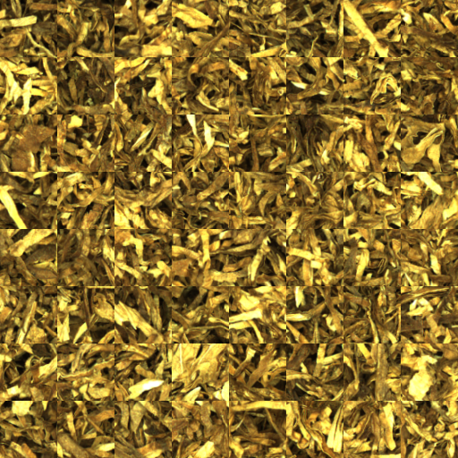
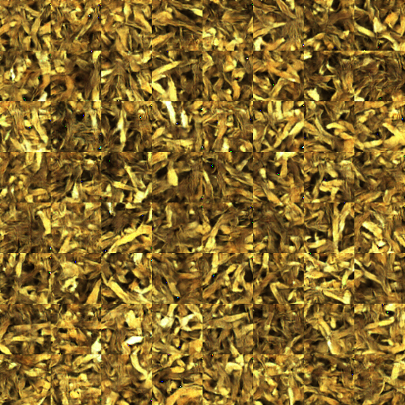
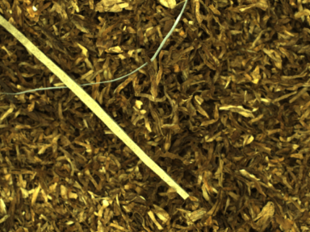
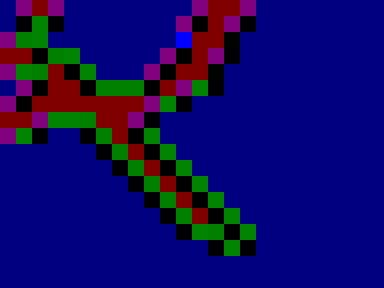

# 一种基于VAEGAN的无监督复杂表面杂物检测算法
本项目为一种基于变分自动编码器以及生成式对抗网络组合的复杂纹理表面缺陷检测方法。
一种常见的应用为烟丝表面杂物检测。本项目搭建了VAE-GAN神经网络，给出了训练、测试
和最终用于检测杂物的代码。<br>
## 文件结构
```
.
|-readme.md
|-train.py
|-test_impurity_detection.py
|-test_encoder_pndata.py
|-model
    |-vaegan.py
|-ops
    |-tensor.py
|-utils
    |-data_set.py
    |-visualization.py
    |-others.py
|-prepare_data_set
    |-label.py
    |-tfrecords_demo.py
    |-tfrecords_encoder_pndata.py
    |-tfrecords_train.py
    |-out
        |-pure
        |-impure
|-data
|-out
|-picture
```
- `readme.md`：本文件
- `train.py`：训练代码
- `test_encoder_pndata.py`：获取正负样本在编码空间的编码的代码
- `test_impurity_detection.py`：测试杂物检测的demo代码
- `model`：网络结构代码所在文件夹
    - `vaegan.py`：VAE-GAN网络结构代码
- `ops`：函数模块文件夹
    - `tensor.py`：TensorFlow构建网络的基础常用模块代码
- `utils`：自定义工具包文件夹
    - `data_set.py`：数据集有关工具包代码
    - `visualization.py`：可视化有关工具包代码
    - `others.py`：其他工具包代码
- `prepare_data_set`：制作数据集相关文件夹
    - `tfrecords_train.py`：生成`train.py`需要的训练集代码
    - `tfrecords_encoder_pndata.py`：生成`test_encoder_pndata.py`需要的测试集代码
    - `tfrecords_demo.py`：生成`test_impurity_detection.py`需要的训练集代码
    - `label.py`：标注工具代码
    - `out`标注工具输出文件夹
        - `impure`：标注为有杂物的图像储存位置
        - `pure`：标注为无杂物的图像储存位置
- `data`：数据集存储文件夹
- `out`：训练测试输出结果所在文件夹
- `picture`：`readme.md`样例图片
## 使用方法
### 制作数据集
本方法需要首先制作数据集供训练测试使用
***
#### 制作训练数据集
由于是无监督模型，训练数据集仅包含正样本。制作训练数据集的程序为`./prepare_data_set/tfrecords_train.py`。
运行方法为
```
python tfrecords_train.py --input_path xxx
```
其中xxx为训练图片所在的绝对路径，输出文件为位于`./data/train.tfrecords`。
#### 制作测试正负样本的数据集
首先需要对原图进行切割并标注正负样本。标注程序为`./prepare_data_set/label.py`。
标注程序的使用方法详情见文件内注释和运行提示。运行参数为
- `--input_path`：待标注的图片绝对路径
- `--height`：滑动窗口高度
- `-p`：表示标注无杂质，不带`-p`表示标注有杂质


标注后的文件结构如下
```
.
|-prepare_data_set
    |-out
        |-pure
        |-impure
```
其中正样本在`pure`路径下，负样本在`impure`路径下。随后运行`./prepare_data_set/tfrecords_encoder_pndata.py`即可。
#### 制作真实图片数据集
制作训练数据集的程序为`./prepare_data_set/tfrecords_demo.py`。
运行方法为
```
python tfrecords_demo.py --input_path xxx
```
其中xxx为图片所在的绝对路径，输出文件为位于`./data/test_impurity_detection.tfrecords`。
***
### 训练
确保`./data/train.tfrecords`存在，并运行
```
python train.py --data_size xxx
```
其中xxx为训练集样本数量。其余参数参见`./train.py`注释。训练生成的图片位于`./out/xxx/samples`下。样例如下
##### 训练输入图片
<br>
##### 训练输出图片
<br>
### 测试正负样本
确保`./data/test_encoder_pndata.tfrecords/`存在，并运行
```
python test_encoder_pndata.py --data_size xxx --out_name yyy
```
其中xxx为测试集样本数量，yyy为训练网络参数输出路径名称，一般位于`./out`下，举例
```
python test_encoder_pndata.py --data_size 400 --out_name 20200402.141647-data-x64.z1024.VAE-GAN.y64.b64
```
最终的输出结果位于`./out/xxx/encoder_code`中，其中xxx为训练网络参数输出路径名称。
输出为`encoder_pndata_1024.npy`和`encoder_pndata_1024.csv`。
输出格式为data size行z维度+1列的表格，最后一列为标签，0代表有杂质，1代表无杂质。
### 测试杂物检测demo
确保`./data/test_impurity_detection.tfrecords`存在，且已经完成训练，并运行
```
python test_impurity_detection.py --data_size xxx --out_name yyy
```
其中xxx为训练集样本数量，yyy为训练网络参数输出路径名称，一般位于`./out`下，举例
```
python test_encoder_pndata.py --data_size 20 --out_name 20200402.141647-data-x64.z1024.VAE-GAN.y64.b64
```
输出内容位于`./out/xxx/detection_results`下，生成的图片效果如图所示
##### 输入图片
<br>
##### 输出图片
<br>

## 贡献者
卢嘉晨